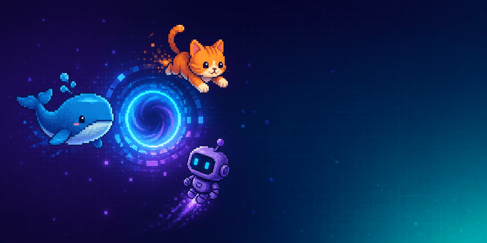

# 🐾 dsh-pet — Customizable Desktop Pets for DeepSeek Harness

[中文](#中文) | [English](#english) | [Install](#install) | [Create a pet pack](docs/PET_PACKS.md)



<a id="中文"></a>
## 中文

**DeepSeek Harness 的可自定义桌宠系统。** 导入自己的精灵图角色和动画定义，让宠物随 Agent 活动变化；它既能在 DSH 设置页中管理，也能在支持的 Electron 桌面壳中显示为透明、可拖拽的 companion 窗口。

内置的 **DeepSeek Whale（小鲸鱼）** 和可复制的社区示例 **[Nailong](examples/pets/nailong/)** 都只是示例宠物，不是系统边界。`dsh-pet` 保存宠物、尺寸和显示状态，校验本地宠物包，并将同一份宠物目录提供给 Web、桌面 companion 和可选终端宿主。

### 你可以做什么

- **使用自己的角色**：导入带 `pet.json` 与 WebP 精灵图的本地宠物包，而不是只能使用内置鲸鱼。
- **感知 Agent 状态**：宠物显示来自 DSH 会话投影的 ready、running、waiting 和 blocked 等人类可见状态。
- **在 Web 或桌面中使用**：设置页管理选择、尺寸、唤醒和刷新；支持的 Electron 壳还能打开透明桌面 companion。
- **安全地管理本地资源**：宿主校验清单、路径、图片几何和资源限制；宠物资源与偏好只留在本地。
- **不增加模型成本**：宠物是展示功能，不会加入模型输入、工具定义或 KV cache。

### 安装

需要 Node.js `^22.19.0` 或 `>=24`，以及 npm 已发布的 DeepSeek Harness `0.1.1-rc.2`。普通用户只需要安装一个 bundle：

```sh
npm install --global @deepseek-ai/dsh@0.1.1-rc.2
dsh plugin --profile web add @luv1211/dsh-pet-desktop@0.1.1-rc.3
dsh web
```

启动后打开 **设置 → Pet**，选择或唤醒宠物。`@luv1211/dsh-pet-desktop` 会按正确顺序组合其余运行时组件；普通用户不需要分别安装内部包。

若系统提示找不到 `dsh`，关闭并重新打开终端后再试。也可以不进行全局安装：

```sh
npm exec --yes --package=@deepseek-ai/dsh@0.1.1-rc.2 -- dsh plugin --profile web add @luv1211/dsh-pet-desktop@0.1.1-rc.3
npm exec --yes --package=@deepseek-ai/dsh@0.1.1-rc.2 -- dsh web
```

### 创建自己的宠物

一个宠物包就是包含 `pet.json` 与其引用 WebP 精灵图的本地目录。精灵图使用 192×208 像素单元、8 列网格，并支持标准 9 行或 v2 11 行 atlas。通过设置页刷新或原生导入功能发现宠物包；不合格的资源不会发布到目录中。

从 [宠物包入门](docs/PET_PACKS.md) 开始，查看最小清单、文件布局，以及 DeepSeek Whale 与 [Nailong](examples/pets/nailong/) 两个示例。

想分享自己的角色、请求功能、报告兼容性问题或帮助改进文档，请阅读 [贡献指南](CONTRIBUTING.md) 与 [社区宠物页](docs/COMMUNITY_PETS.md)。

### 项目组成

| 使用场景 | 包或目录 | 职责 |
|---|---|---|
| 一键安装入口 | [`@luv1211/dsh-pet-desktop`](packages/bundle/pet-desktop/README.zh.md) | Bundle，按顺序组合宠物服务、命令和 Web UI |
| 宠物系统 | [`@luv1211/dsh-pet`](packages/pet/pet/README.zh.md) | 偏好、已校验目录、活动读模型和同源 API |
| 自定义包格式 | [`@luv1211/dsh-pet-compat`](packages/pet/compat/README.zh.md) | 精灵图、动画和兼容值 |
| DSH 控制界面 | [`@luv1211/dsh-client-ui-pet`](packages/client/ui-pet/README.zh.md) | 设置、选择、刷新、导入和 `/pet` 命令展示 |
| 桌面 companion | [`@luv1211/dsh-desktop-companion`](packages/desktop/companion/README.zh.md) 与 [`desktop/`](desktop/README.zh.md) | 注册并承载可拖拽透明窗口 |
| 终端宿主 | [`@luv1211/dsh-pet-tui`](packages/pet/tui/README.zh.md) | 可选的 Kitty/Sixel 与文本回退呈现 |

### 兼容性与限制

- 本版本面向 npm 已发布的 DeepSeek Harness `0.1.1-rc.2`；上游 `0.1.2-alpha.1` 不是本版本的兼容目标。
- 透明置顶桌面窗口需要带 companion bridge 的 Electron 壳；浏览器会保留宠物选择、活动和唤醒控制，但不会创建系统窗口。
- 外部文件系统改动不会自动监视。目录会在启动、导入、替换或设置页刷新时更新。

完整的发布修复与验证范围见 [0.1.1-rc.3 更新说明](docs/releases/0.1.1-rc.3.md)。

### 开发

```sh
pnpm install
pnpm typecheck
pnpm test
pnpm build
pnpm release:verify
```

<a id="english"></a>
## English

**A customizable desktop-pet system for DeepSeek Harness.** Bring your own sprite-based character and animation metadata, let it reflect agent activity, and manage it from the DSH Web UI or, when available, a transparent draggable Electron companion window.

The bundled **DeepSeek Whale** and the copyable community example **[Nailong](examples/pets/nailong/)** are example pets, not the limit of the system. `dsh-pet` persists pet selection, size, and visibility; validates local pet packs; and serves the same catalog to Web, desktop-companion, and optional terminal hosts.

### What you can do

- **Use your own character** — import a local pet pack with `pet.json` and a WebP sprite atlas instead of being limited to the bundled whale.
- **Reflect agent activity** — pets render human-facing ready, running, waiting, and blocked activity from DSH session projections.
- **Use Web or desktop presentation** — manage selection, size, wake state, and refresh in Settings; a supported Electron shell can open a transparent desktop companion.
- **Keep local assets safe** — the host validates manifests, paths, image geometry, and resource limits; pet assets and preferences remain local.
- **Add no model cost** — the pet is presentation-only and contributes no model input, tool definition, or KV-cache state.

<a id="install"></a>
### Install

Node.js `^22.19.0` or `>=24` and the npm-published DeepSeek Harness `0.1.1-rc.2` are required. Most users install one bundle:

```sh
npm install --global @deepseek-ai/dsh@0.1.1-rc.2
dsh plugin --profile web add @luv1211/dsh-pet-desktop@0.1.1-rc.3
dsh web
```

Open **Settings → Pet** after startup to select or wake a pet. `@luv1211/dsh-pet-desktop` installs and composes the remaining runtime packages in their required order; end users do not install those internal packages separately.

### Create your own pet

A pet pack is a local directory containing `pet.json` and the WebP atlas it names. Atlases use 192×208-pixel cells in an 8-column grid; the system accepts the standard 9-row atlas and the v2 11-row atlas. The Settings page can refresh the catalog, and native hosts can offer import; invalid resources never enter the published catalog.

Start with [Create a pet pack](docs/PET_PACKS.md) for the smallest manifest, directory layout, and the DeepSeek Whale and [Nailong](examples/pets/nailong/) examples.

To share a character, request a feature, report a compatibility result, or improve the documentation, read [Contributing](CONTRIBUTING.md) and [Community pets](docs/COMMUNITY_PETS.md).

### Project map

| Use case | Package or directory | Responsibility |
|---|---|---|
| One-command installation | [`@luv1211/dsh-pet-desktop`](packages/bundle/pet-desktop/README.md) | Bundle that composes the pet service, command, and Web UI in order |
| Pet system | [`@luv1211/dsh-pet`](packages/pet/pet/README.md) | Preferences, validated pet catalog, activity read model, and same-origin API |
| Custom-pack format | [`@luv1211/dsh-pet-compat`](packages/pet/compat/README.md) | Sprite, animation, and compatibility values |
| DSH controls | [`@luv1211/dsh-client-ui-pet`](packages/client/ui-pet/README.md) | Settings, selection, refresh, import, and `/pet` command presentation |
| Desktop companion | [`@luv1211/dsh-desktop-companion`](packages/desktop/companion/README.md) and [`desktop/`](desktop/README.md) | Registers and hosts the draggable transparent window |
| Terminal host | [`@luv1211/dsh-pet-tui`](packages/pet/tui/README.md) | Optional Kitty/Sixel output with a text fallback |

### Compatibility and limitations

- This version targets npm-published DeepSeek Harness `0.1.1-rc.2`; upstream `0.1.2-alpha.1` is not a compatibility target for this release.
- The always-on-top transparent window needs an Electron shell with the companion bridge. Browser sessions keep catalog, activity, and wake controls but do not create a system window.
- External directory changes are not watched. The catalog refreshes at startup, after import or replacement, or from the Settings page.

Read the [0.1.1-rc.3 release notes](docs/releases/0.1.1-rc.3.md) for the repair scope and verification coverage.

### Development

```sh
pnpm install
pnpm typecheck
pnpm test
pnpm build
pnpm release:verify
```

## License

[MIT](LICENSE) — a derivative work of [DeepSeek Harness](https://github.com/deepseek-ai/deepseek-harness).
